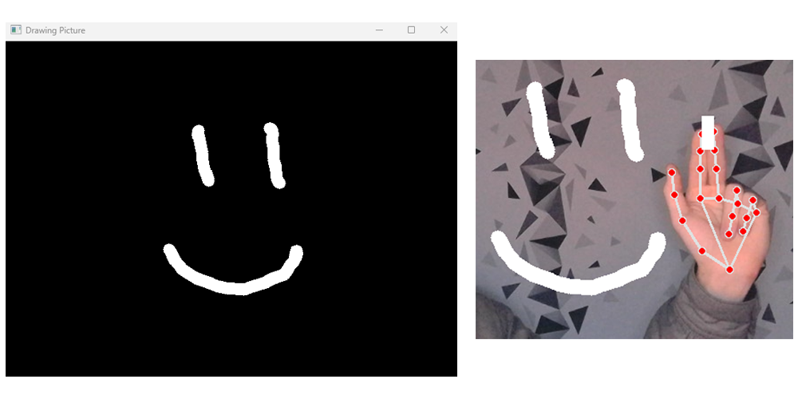

# DrawItium

This app allow you to draw with your fingers using AI recognition.

You will find the possibility to draw with several colors, blue, red, green, white and random colors which generate automatically.



## Tech Stack

**AI Recognition:** mediapipe

**Drawing:** OpenCV

**Interface:** Tkinter


## Installation

The fastest way is to clone the repository and click on the **'start-app.bat'** and the application will **launch automatically**.

If you want to run the code from your code environment, do this :

=> You need to install **Python 3.11**

1-/ Clone this repository ```git clone https://github.com/nixiz0/DrawItium.git```

2-/ Create your environment ```python -m venv .env```

3-/ Download required libraries ```pip install -r requirements.txt```

4- Run the menu.py ```python menu.py```
## Feature Guide
**Camera Number :** You must enter the number of your camera you want to use, if you only have 1 camera then it will be 0, if you have 2 then it will be 1 etc

**Width & Height Camera :** You will also be asked for the detection width and height of your camera. For this you must click on the *"Cam Info"* button. Enter the number of the camera you want to use and you will have information on width and height that your camera uses.

**Superposition :** 
- If you put *"yes"* then it will merge the drawing layer (canvas) with your video screen, it will set alpha to 50% for both so the brightness will be lower
- If you put *"no"* then it will keep the 2 screens, the drawing screen (canvas) and your camera screen, the drawing will be drawn on your video screen and on your canvas

## Drawing Tools


**-->** On the far left you have the tool that generates a **random color** every few seconds

**-->** Then you have the 3 classic **colors red, blue and green**

**-->** If you place your fingers **between the color palette and the black hole** it will automatically **select the white color**

**-->** If you select the **black hole** it will automatically **delete all your drawing**

**-->** On the right you have the possibility to choose between **2 different brush sizes**. This will automatically change the **size of your brush and eraser**

**-->** Finally, on the far right you have the **eraser** which allows you to **erase whatever you want**
## Author

- [@nixiz0](https://github.com/nixiz0)

